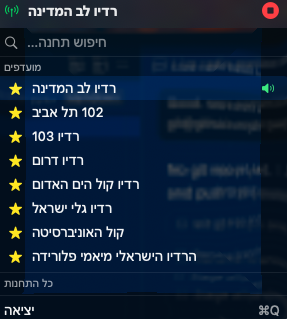

# Israel Radio - macOS Menu Bar App

A lightweight macOS menu bar app for streaming Israeli radio stations. Click the radio icon in your menu bar, pick a station, and listen — no browser needed.

<p align="center">
  
</p>

## Features

- **86 Israeli radio stations**
- **Menu bar only** — no Dock icon, no window clutter
- **Now playing** — current station name shown in the menu bar
- **Favorites** — star stations to pin them at the top of the list
- **Search** — filter stations by name in Hebrew or English
- **All stream types** — handles MP3, AAC, and HLS (`.m3u8`) natively via AVPlayer

## Requirements

- macOS 14 (Sonoma) or later
- Xcode Command Line Tools or Xcode (for building from source)

## Install

### Quick install (build + copy to Applications)

```bash
cd IsraelRadio
bash build_app.sh
```

This builds a release binary, packages it as `IsraelRadio.app` with an icon and `Info.plist`, and places it in `/Applications`. Launch it from Spotlight, Launchpad, or Finder.

### Development mode

```bash
cd IsraelRadio
swift run
```

## Start at Login

1. Open **System Settings > General > Login Items**
2. Click **+** under "Open at Login"
3. Select `/Applications/IsraelRadio.app`

## Available Stations

| # | Station |
|---|---------|
| 1 | כאן 88 |
| 2 | רדיו תשעים |
| 3 | רדיו לב המדינה |
| 4 | 102 תל אביב |
| 5 | רדיוס 100FM |
| 6 | גלי צהל |
| 7 | רדיו 99FM |
| 8 | גלגלצ |
| 9 | רדיו 103 |
| 10 | כאן ב |
| 11 | רדיו חיפה |
| 12 | רדיו שירי אהבה |
| 13 | רדיו קול המזרח |
| 14 | רדיו דרום |
| 15 | רדיו התחנה 101.5 |
| 16 | כאן גימל |
| 17 | רדיו אשל הנשיא |
| 18 | Classic FM |
| 19 | רדיו פלוס |
| 20 | כאן מורשת |
| 21 | רדיו קול חי |
| 22 | רדיו א-שמס |
| 23 | רדיו קול רגע |
| 24 | רדיו נושמים מזרחית |
| 25 | רדיו ירושלים |
| 26 | כאן קול המוסיקה |
| 27 | רדיו קול הים האדום |
| 28 | כאן תרבות |
| 29 | רדיו גלי ישראל |
| 30 | רדיו קול יזרעאל 106FM |
| 31 | רדיו קול ברמה |
| 32 | רדיו קול הכנרת |
| 33 | רדיו חולמים מזרחית |
| 34 | רדיו סהר |
| 35 | רדיו קול נתניה 106FM |
| 36 | ערוץ הכנסת |
| 37 | רדיו נטו |
| 38 | רדיו חוף אילת |
| 39 | רדיו סול |
| 40 | רדיו יאסו |
| 41 | רדיו מהות החיים |
| 42 | רדיו קבלה FM |
| 43 | קול רמת השרון |
| 44 | רדיו אלכרמל |
| 45 | Первое радио 89.1FM |
| 46 | קול האוניברסיטה |
| 47 | רדיו דרום 101.5 |
| 48 | רדיו שירי דיכאון |
| 49 | רדיו ביט |
| 50 | רדיו 99.5 חם אש |
| 51 | רדיו מזרחית |
| 52 | הרדיו הישראלי מיאמי פלורידה |
| 53 | רדיו קול המרכז |
| 54 | רדיו ברסלב - קול הנחל |
| 55 | רדיו כחול יוון |
| 56 | רדיו רן (פרסית) |
| 57 | רדיו המזרח |
| 58 | הרדיו החברתי הראשון |
| 59 | רדיו הקצה |
| 60 | רדיו קול הגליל העליון 105.3FM |
| 61 | רדיו קצב ים תיכוני |
| 62 | רדיו צפון 104.5 |
| 63 | Jazz FM |
| 64 | רדיו קול הגולן |
| 65 | רדיוס נוסטלגי 96.3FM |
| 66 | רדיו מרטיט מיתר בלב |
| 67 | BeatFM |
| 68 | עברי שש |
| 69 | Up2Dance Radio |
| 70 | רדיו 69FM |
| 71 | רדיו קול השפלה |
| 72 | רדיו קצב מזרחית |
| 73 | MUZIKA 106.4FM |
| 74 | כאן רקע |
| 75 | רדיו זה רוק |
| 76 | Radio Salsa Tel Aviv |
| 77 | רדיו חדש על הגל |
| 78 | רדיו בריזר |
| 79 | רדיו חמש ישראל |
| 80 | רדיו לב הים התיכון |
| 81 | רדיו לב העיר |
| 82 | רדיו מנטה |
| 83 | רדיו קריות |
| 84 | רדיו חולמים ים תיכוני |
| 85 | רדיו נושמים אהבה |
| 86 | רדיו מוסיכיף 69FM |

## Project Structure

```
IsraelRadio/
├── Package.swift                      # SPM manifest (macOS 14+)
├── build_app.sh                       # Builds release .app bundle
├── README.md
├── assets/
│   └── screenshot.png                 # App screenshot
└── Sources/IsraelRadio/
    ├── IsraelRadioApp.swift           # App entry, MenuBarExtra setup
    ├── RadioStation.swift             # Station model, M3U parser, embedded data
    ├── RadioPlayer.swift              # AVPlayer wrapper (play/stop/toggle)
    ├── FavoritesManager.swift         # UserDefaults-backed favorites
    └── StationListView.swift          # SwiftUI menu bar panel UI
```

## How It Works

1. Station data is embedded in the binary as a compressed and encoded blob — no plaintext URLs in source.
2. On launch, the data is decoded and decompressed into an M3U playlist, then parsed into station objects.
3. A `MenuBarExtra` with `.window` style renders the station list as a rich SwiftUI popover.
4. Tapping a station creates an `AVPlayerItem` from the stream URL and plays it via `AVPlayer`.
5. The menu bar label updates to show the currently playing station name.
6. Favorites are persisted to `UserDefaults` and shown in a dedicated section at the top.

## Updating Stations

To update the station list:

1. Prepare an M3U file with the new stations in standard format:
   ```
   #EXTM3U
   #EXTINF:-1,Station Name
   https://stream-url.example.com/live
   ```
2. Compress and encode it:
   ```bash
   python3 -c "
   import base64, zlib
   with open('stations.m3u', 'rb') as f:
       print(base64.b64encode(zlib.compress(f.read(), 9)).decode())
   "
   ```
3. Replace the `encoded` string in `RadioStation.swift` with the output.
4. Rebuild with `bash build_app.sh`.

## Tech Stack

| Component | Technology |
|-----------|-----------|
| Language | Swift 6 |
| UI | SwiftUI (`MenuBarExtra`) |
| Audio | AVFoundation (`AVPlayer`) |
| Build | Swift Package Manager |
| Persistence | `UserDefaults` |
